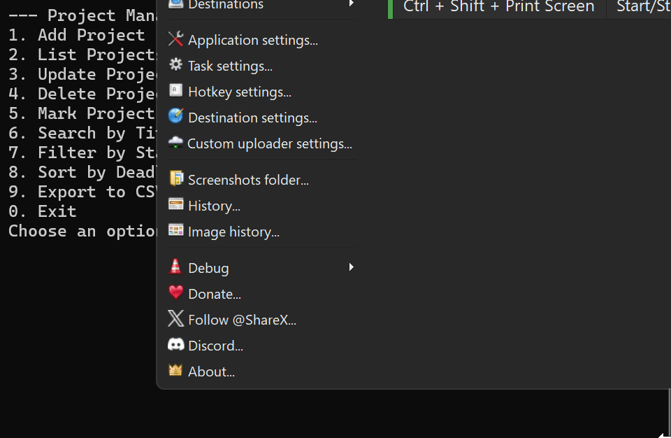

# Project Management CLI Application

A simple command-line Project Management application written in Python using SQLite.  
Manage your projects with CRUD operations, search, filter, sort, and export to CSV.

---

## Features

- Add, list, update, delete projects
- Mark projects as complete
- Search projects by title
- Filter projects by status (`todo`, `in_progress`, `done`)
- Sort projects by deadline
- Export projects to CSV
- Robust logging and error handling

---

## Installation

1. Clone the repository:

```bash
git clone https://github.com/Zocko90/Project-Management-App.git
cd Project-Management-App

2. Make sure you have Python 3.9+ installed.
3. Install required packages (if using pandas for CSV export):

pip install pandas


##Usage

Run the CLI menu:
python main.py


##Example Interaction

Add a Project:
--- Project Management Menu ---
1. Add Project
2. List Projects
3. Update Project
4. Delete Project
5. Mark Project Complete
6. Search by Title
7. Filter by Status
8. Sort by Deadline
9. Export to CSV
0. Exit
Choose an option: 1
Title: Build Portfolio Website
Description: Personal site with Python projects
Priority (1-5, default 3): 2
Deadline (YYYY-MM-DD, optional): 2025-09-30
Project 'Build Portfolio Website' added.

##List Projects:

ID: 8 | Title: Build Portfolio Website | Status: todo | Priority: 2 | Deadline: 2025-09-30


##Screenshots / Demo

Below is a short demo GIF showing the basic usage of the Project Management CLI application:



##Logging

All events and errors are logged to app.log for easy tracking and debugging.

Requirements:
-Python 3.9+
-SQLite3 (comes pre-installed with Python)
-pandas (optional, for CSV export)

##License

MIT License